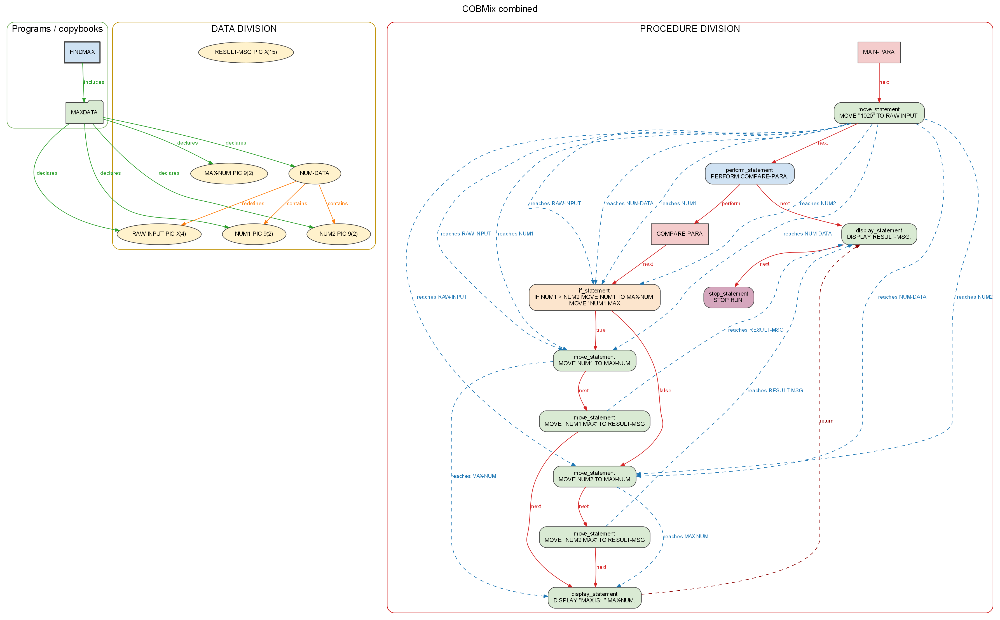
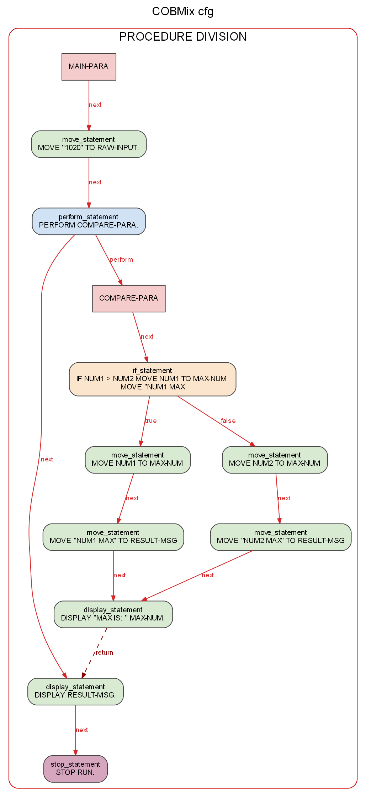
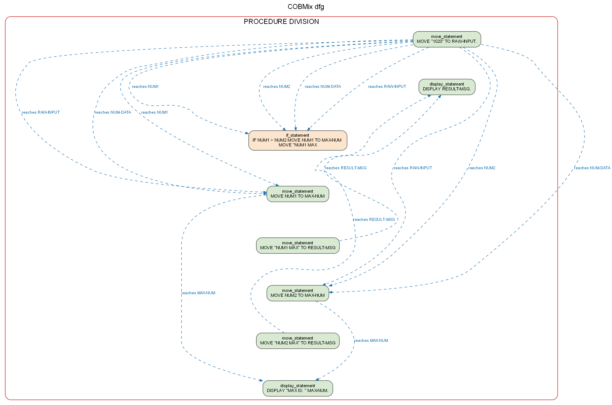
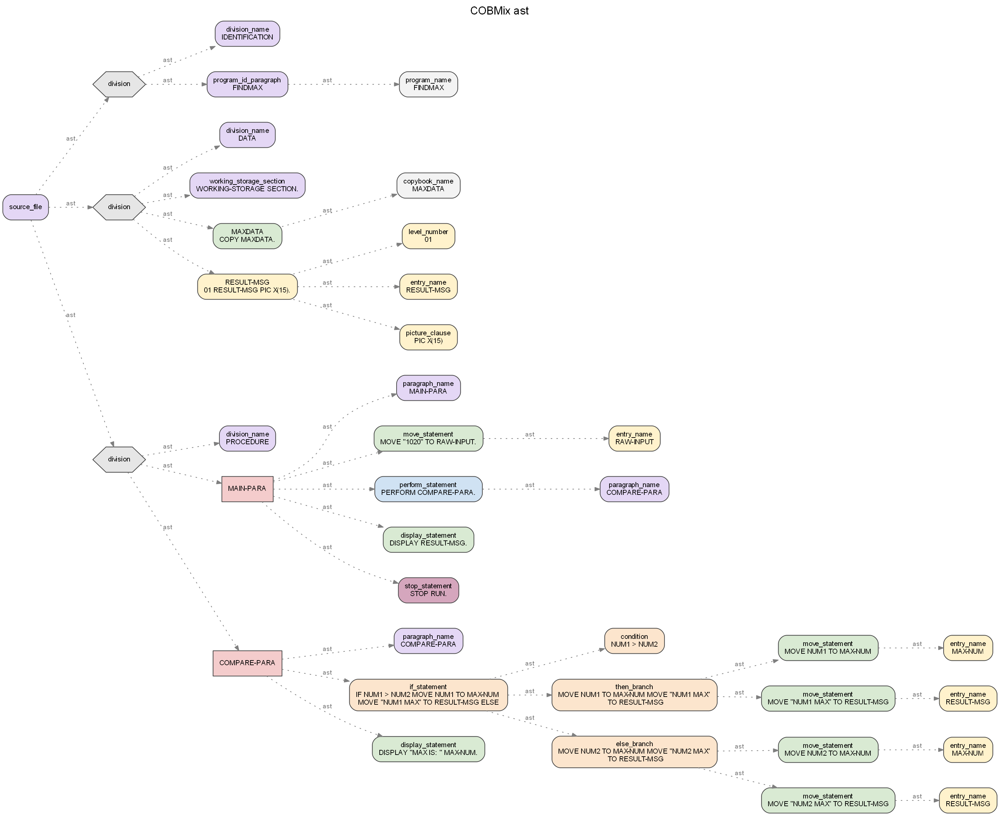
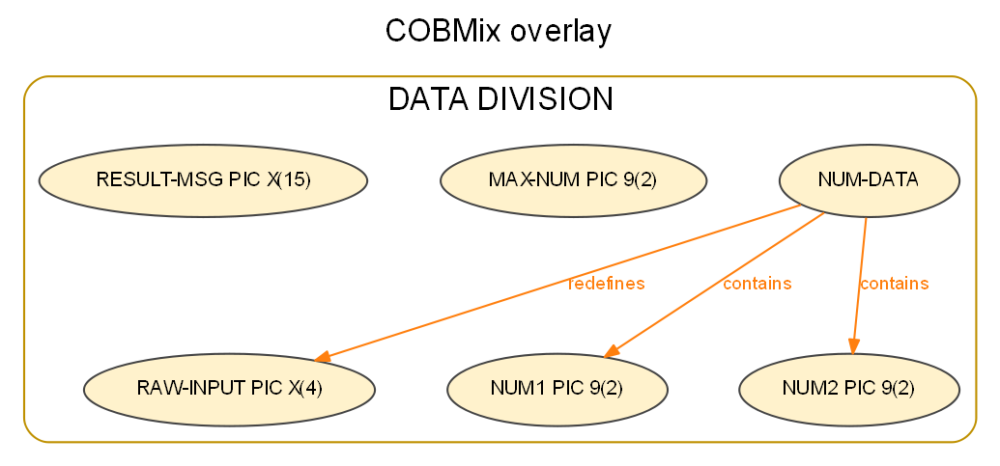
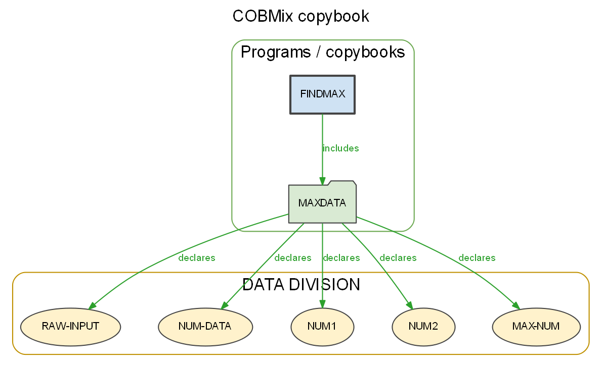
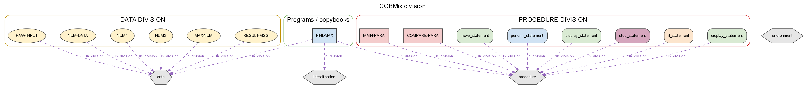
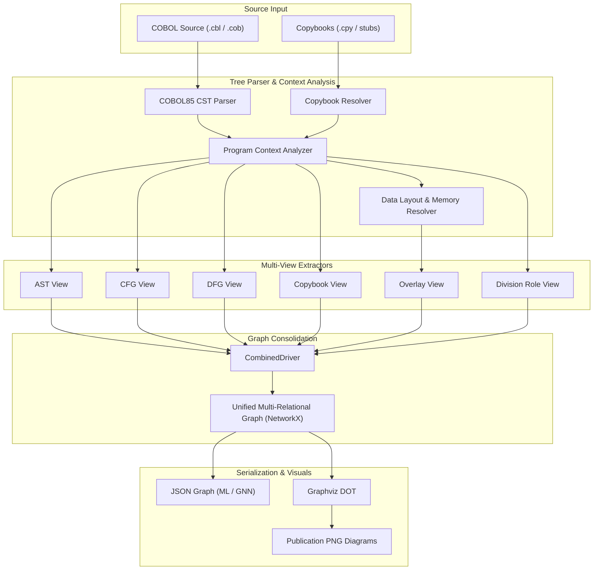

# COBMix – Customized Multi-View Code Representation Extractor for COBOL


## 🎯 Tool Description

**COBMix** is an advanced multi-view code representation and graph extractor built specifically for legacy COBOL software systems. It parses COBOL programs—even incomplete code fragments or legacy programs with missing copybook definitions—and constructs rich syntactic, semantic, and architectural code property graphs.

COBMix extracts six complementary code views: **Abstract Syntax Trees (AST)**, **Control Flow Graphs (CFG)**, **Data Flow Graphs (DFG)**, **Copybook Inclusion Hierarchies**, **Storage Overlay Structures** (level numbers, `REDEFINES`, `OCCURS`, `RENAMES`), and **Division Role Mappings**. By fusing these views into a unified multi-relational representation, COBMix bridges the gap between legacy enterprise codebases and modern program analysis, machine learning on code, graph neural networks (GNNs), software clone detection, and automated program comprehension.

---

## 🌟 Key Features

- 🌲 **Multi-View Graph Extraction** – Extracts 6 complementary program representations: AST, CFG, DFG, Copybook hierarchy, Memory Overlay, and Division roles.  
- 🔄 **Unified Multi-Relational Representation** – Fuses control flow, data dependencies, memory aliasing, and modular inclusion into a cohesive code property graph.  
- 🛡️ **Tolerant & Robust Parsing** – Built on a dedicated COBOL85 CST parser aligned with Tree-Sitter grammar that processes standalone programs, subprograms, and isolated copybook snippets without requiring full compilation.  
- 📊 **Publication-Quality Visualizations** – Graphviz `dot` engine integration for automated rendering of clean, publication-grade hierarchical diagrams with distinct color-coded edges and clustered subgraphs.  
- 💾 **Multi-Format Export** – Flexible serialization into structured **JSON** (ideal for Graph Neural Networks and ML pipelines), Graphviz **DOT**, and high-resolution **PNG** graphics.  
- ⚡ **High Throughput & Scalable** – Optimized network building pipeline capable of profiling large-scale enterprise corpora (such as X-COBOL) across thousands of programs.  
- 🧪 **Built-in Empirical Evaluation Suite** – End-to-end benchmarking pipelines for code clone detection, identifier naming, business rule classification, and ablation studies.  
- 🐍 **Dual Interface** – Available both as a command-line interface (`cobmix`) and as an extensible Python programmatic API (`CombinedDriver`).  

---

## 💻 System Requirements

> **Note:** COBMix is an offline, local tool and Python framework (it does not require a hosted web server or cloud deployment).

### Hardware Requirements

- **Supported Devices:** Laptop, Desktop, or Server (Windows, macOS, Linux)  
- **CPU:** Any modern processor (Intel Core i3/i5/i7/i9, AMD Ryzen, Apple Silicon M1/M2/M3/M4)  
- **RAM:** Minimum 4 GB (8 GB or 16 GB recommended for large-scale corpus evaluation)  
- **Storage:** At least 500 MB free disk space (additional space recommended when evaluating large COBOL corpora)  

### Software Dependencies

#### Environment & Runtime
- **Operating System:** Windows 10/11, macOS 12+, or Linux (Ubuntu 20.04+, Debian, Fedora)  
- **Python:** Version 3.10 or higher  
- **Graphviz:** Version 2.40+ (required for generating DOT layout and PNG visualization figures)  
- **Package Manager:** `pip`  

#### Required Python Packages

**Core Engine:**
- `networkx` (^3.2) – Graph construction, manipulation, and multi-relational graph merging  

**Development & Testing:**
- `pytest` (^7.4) – Test suite execution and validation  

**Evaluation & Research Pipeline (Optional for Benchmarks):**
- `pandas` – Tabular metrics and corpus profiling  
- `scipy` – Statistical hypothesis testing (Wilcoxon signed-rank tests)  
- `matplotlib` – Evaluation plots and paper figure generation  
- `psutil` – Resource profiling and throughput benchmarking  

---

## 📦 Installation

### ⚡ Quick Install (via PyPI)

COBMix is published on [PyPI (Python Package Index)](https://pypi.org/project/cobmix/0.1.0/) and can be installed directly with `pip`:

```bash
pip install cobmix==0.1.0
```

Verify your installation:
```bash
cobmix --help
```

---

### 🛠️ Development Setup (from Source)

Follow these steps if you want to set up COBMix locally from source for development or to reproduce the evaluation benchmarks:

#### 1. Clone the Repository

```bash
git clone https://github.com/satish-pati/Cobmix.git
cd Cobmix
```

#### 2. Set Up a Virtual Environment

**Windows (PowerShell):**
```powershell
python -m venv venv
.\venv\Scripts\Activate.ps1
```

**macOS / Linux:**
```bash
python3 -m venv venv
source venv/bin/activate
```

#### 3. Install Python Dependencies

Install COBMix in editable mode along with development dependencies:

```bash
pip install -e ".[dev]"
```

*(Optional)* If you plan to run the empirical evaluation and benchmarking suite:
```bash
pip install scipy matplotlib pandas psutil
```

### 4. Install Graphviz (Required for PNG Visualizations)

Graphviz provides the `dot` layout engine used to generate visual diagrams.

**Windows:**
```powershell
winget install Graphviz.Graphviz
```
*Or download the Windows installer from [graphviz.org](https://graphviz.org/download/). Ensure `dot.exe` is added to your system `PATH`. Verify in a new terminal with `dot -V`.*

> **Tip:** If `dot` is installed but not on your system `PATH`, you can set the `GRAPHVIZ_DOT` environment variable (e.g., `set GRAPHVIZ_DOT=C:\Program Files\Graphviz\bin\dot.exe`).

**macOS:**
```bash
brew install graphviz
```

**Ubuntu / Debian:**
```bash
sudo apt update
sudo apt install graphviz
```

### 5. Verify the Installation

Run the test suite to verify everything is working properly:

```bash
pytest tests/ -v
```

---

## 🚀 Usage

COBMix can be used either as a command-line tool (`cobmix`) or as a Python library.

### How to Use *COBMix*

1. **Prepare your COBOL source files** (`.cbl`, `.cob`) and any copybooks (`.cpy`) in a directory (e.g., `samples/find_max.cbl` and `samples/copy/MAXDATA.cpy`).
2. **Select the desired code views** (`ast`, `cfg`, `dfg`, `copybook`, `overlay`, `division`).
3. **Execute the extractor** via CLI or the Python API.
4. **Inspect generated graphs** in JSON format for downstream ML tasks, or DOT/PNG for visual inspection.
5. **Analyze the resulting multi-relational graphs** or pass them to graph neural networks.

---

### Command-Line Interface (CLI)

#### 1. Full Multi-View Extraction (JSON, DOT, and PNG)

Extract combined CFG, DFG, AST, memory overlay, copybook, and division views for `find_max.cbl`:

```bash
python -m cobmix --code-file samples/find_max.cbl --copy-path samples/copy --graphs cfg,dfg,ast,overlay,copybook,division --format all --output out/find_max.json
```

This command generates both combined and individual view files:

| File | Contents |
|---|---|
| `out/find_max.json` | Full unified multi-relational graph (nodes, edges, attributes) |
| `out/find_max.dot` | Graphviz DOT source for combined figure (CFG + DFG + overlay + copybook) |
| `out/find_max.png` | Rendered combined diagram (Graphviz `dot` COMEX layout) |
| `out/find_max-cfg.png` / `.dot` | Control Flow Graph only |
| `out/find_max-dfg.png` / `.dot` | Data Flow Graph only |
| `out/find_max-ast.png` / `.dot` | Abstract Syntax Tree only |
| `out/find_max-overlay.png` / `.dot` | Storage overlay only |
| `out/find_max-copybook.png` / `.dot` | Copybook inclusion hierarchy only |
| `out/find_max-division.png` / `.dot` | Division role mappings only |

#### 2. Paper-Style Combined Figure (CFG + DFG)

Generate the classic COMEX-style control-flow and data-flow combined graph:

```bash
python -m cobmix --code-file samples/find_max.cbl --copy-path samples/copy --graphs cfg,dfg --format png --output out/cfg-dfg.png
```

#### 3. Single-View Extraction

Extract only the storage overlay structure (e.g., `REDEFINES` and `OCCURS` hierarchy):

```bash
python -m cobmix --code-file samples/overlay-demo.cbl --graphs overlay --format png --output out/overlay.png
```

#### 4. Machine-Readable JSON Export (For ML / GNN Pipelines)

Export graph representations without rendering graphics:

```bash
python -m cobmix --code-file samples/find_max.cbl --copy-path samples/copy --graphs ast,cfg,dfg,copybook,overlay,division --format json --output out/find_max.json
```

#### CLI Options Reference

| Argument | Description | Default |
|---|---|---|
| `--code-file` | Path to COBOL source file (`.cbl`, `.cob`). Repeatable for multi-file contexts. | *Required* |
| `--copy-path` | Directory or file path to search for COPY books. Repeatable. | `[]` |
| `--graphs` | Comma-separated list of views: `ast,cfg,dfg,copybook,overlay,division` | All views |
| `--format` | Output format: `json`, `dot`, `png`, or `all` | `json` |
| `--output` | Destination file path for generated graph artifacts | `cobmix-output.json` |

---

### Python API

You can directly integrate COBMix into your Python analysis scripts or ML data loaders:

```python
from cobmix import CombinedDriver

# Initialize and extract code views
driver = CombinedDriver(
    src_code=open("samples/find_max.cbl", encoding="utf-8").read(),
    copy_paths=["samples/copy"],
    graphs=["cfg", "dfg", "overlay", "copybook", "ast", "division"],
    output_file="out/find_max.json",
    graph_format="all",  # writes JSON, DOT, and PNG
)

# Access the resulting NetworkX DiGraph directly in memory
graph = driver.graph
print(f"Total Nodes: {graph.number_of_nodes()}")
print(f"Total Edges: {graph.number_of_edges()}")

# Access individual view subgraphs
cfg_view = driver.views.get("cfg")
dfg_view = driver.views.get("dfg")
ast_view = driver.views.get("ast")
```

---

## 📊 Extracted Code Views & Visual Legend

### Supported Views

| View | What It Captures | Primary Constructs |
|---|---|---|
| `ast` | Filtered Abstract Syntax Tree | Divisions, sections, paragraphs, statements |
| `cfg` | Statement-level control flow | `PERFORM`, `PERFORM THRU`, `IF`, `EVALUATE`, `GO TO`, `CALL` |
| `dfg` | Reaching definitions with memory overlay aliases | `MOVE`, `COMPUTE`, arithmetic, `READ INTO`, `SET` |
| `copybook` | Modular dependency and inclusion structure | `COPY` statements, shared books, unresolved stubs |
| `overlay` | Memory layout and storage aliasing | Level numbers (`01`–`49`), `REDEFINES`, `OCCURS`, `RENAMES` |
| `division` | Program architectural roles | `IDENTIFICATION`, `ENVIRONMENT`, `DATA`, `PROCEDURE` |

For formal definitions of node types and edge semantics, see [docs/views.md](docs/views.md).

### Diagram Visual Legend (PNG)

When rendered via Graphviz `dot`, COBMix employs standard color coding:

- 🔴 **Red Solid Lines** – Control flow edges (`next`, `true`, `false`, `perform`, `thru`, `goto`, `call`)
- 🔵 **Blue Dashed Lines** – Data flow edges (`reaches`, `def`, `use`)
- 🟠 **Orange Lines** – Storage overlay relationships (`contains`, `redefines`, `occurs`, `renames`)
- 🟢 **Green Lines** – Copybook dependencies (`includes`, `declares`)
- 🟪 **Pink Rectangles** – Paragraphs and section headers
- ⬜ **White Rounded Boxes** – Procedure Division statements
- 🟡 **Yellow Ellipses** – Data item names and variables

---

## 📸 Visualizations & Output Gallery (`find_max.cbl`)

The following figures illustrate the real outputs generated by COBMix when analyzing [`samples/find_max.cbl`](samples/find_max.cbl) with [`samples/copy/MAXDATA.cpy`](samples/copy/MAXDATA.cpy).

### 1. Unified Combined Code Property Graph
Fuses control flow (red), data flow reaches (dashed blue), storage overlay (orange), and copybook inclusion (green) into a single heterogeneous code representation.


### 2. Control Flow Graph (CFG)
Models paragraph sequencing (`MAIN-PARA` → `COMPARE-PARA`), `PERFORM` calls, and conditional branching (`IF NUM1 > NUM2`).


### 3. Data Flow Graph (DFG)
Traces definitions (`def`), usages (`use`), and reaching definition chains (`reaches`) across statements and aliased memory records.


### 4. Abstract Syntax Tree (AST)
Captures the hierarchical grammar structure of divisions, sections, paragraphs, and statements.


### 5. Storage Overlay View
Models data memory layout, hierarchy levels, and memory aliasing introduced by `REDEFINES` (e.g. `NUM-DATA` redefines `RAW-INPUT`).


### 6. Copybook Inclusion Hierarchy
Tracks modular dependencies and variable definitions originating inside external copybook files (`MAXDATA.cpy`).


### 7. Division Role Mapping
Annotates and groups syntax and semantic nodes according to their COBOL architectural division (`IDENTIFICATION`, `DATA`, `PROCEDURE`).


---

## 🏗️ Architecture

### System Architecture Diagram



### Component Architecture

#### 1. Parser & Semantic Engine (`src/cobmix/tree_parser/`)
- **`cobol_parser.py`** – Custom COBOL85 CST grammar parser matching Tree-Sitter constructs; gracefully recovers from partial syntax.
- **`context.py`** – Tracks lexical scope, paragraph headers, data entries, and procedure statements into a `ProgramContext`.
- **`data_layout.py`** – Computes memory offsets, level hierarchy, and aliasing created by `REDEFINES` and `OCCURS`.
- **`copy_resolver.py`** – Searches include paths for COPY books and generates stubs for missing libraries.

#### 2. Code View Generators (`src/cobmix/codeviews/`)
- **`ast/`** – Builds the hierarchical syntax tree stripped of formatting noise.
- **`cfg/`** – Builds execution flow, branching logic, and paragraph call/return semantics.
- **`dfg/`** – Traces reaching definitions and variable use chains across statements and overlays.
- **`copybook/`** – Maps multi-file modular boundaries and variable declarations.
- **`overlay/`** – Models memory layout structures and data alias relationships.
- **`division/`** – Categorizes each node according to its high-level COBOL division role.
- **`combined/`** – Merges requested view graphs into a cohesive multi-relational structure (`CombinedDriver`).

#### 3. Utilities & Serialization (`src/cobmix/utils/`)
- **`graph.py`** – Serialization utilities to export graphs to JSON and invoke Graphviz `dot` for publication-quality layouts.

#### 4. Empirical Evaluation Suite (`eval/`)
- **Corpus Profiling:** `profile_constructs.py`, `profile_units.py`
- **Benchmarking & Robustness:** `benchmark_throughput.py`, `run_corpus.py`
- **Dataset Construction:** `build_clone_dataset.py`, `build_naming_dataset.py`
- **Model Training & Evaluation:** `train_eval.py`, `ablation.py`, `stats.py`

### Key Technologies

- **Language:** Python 3.10+
- **Graph Framework:** NetworkX 3.2+
- **Visual Rendering:** Graphviz (`dot` hierarchical ranking layout)
- **Grammar & Parsing:** COBOL85 CST engine aligned with Tree-Sitter COBOL
- **Testing:** Pytest

---

## 🧪 Evaluation & Research Pipeline

COBMix comes with a complete scientific evaluation suite designed for empirical software engineering studies on large COBOL corpora (e.g., [X-COBOL](https://github.com/RISHA-Lab/X-COBOL)):

```bash
# 1. Run unit tests
pytest tests/ -v

# 2. Benchmark throughput across view combinations
python eval/benchmark_throughput.py --corpus-dir <path-to-corpus> --runs 5

# 3. Profile language constructs and units
python eval/profile_constructs.py --corpus-dir <path-to-corpus>

# 4. Train and evaluate downstream models (clones, naming, business rules)
python eval/train_eval.py --task clone --conditions all --seeds 5
```

See [eval/README.md](eval/README.md) for full execution phases, gate criteria, and paper replication guidelines.

---

## 👥 Contributors

